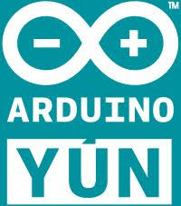

  
  
<<----- Tristar Modbus <<--python_bridge->> Arduino Yun----->>

  

  
Modbus Comms with Morningstar's Tristar MPPT-60 bridged to Arduino Yun in python

# Soo many thanks to whoever I picked this up from - just to many spources to name and still get shit done.  Many thanks to your hard work, if you recognize it.
